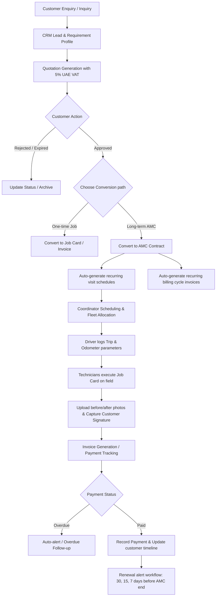

# TEAM ENVIRO CLEANING SERVICES
# Operational Workflow & Logic

---

## 1. END-TO-END OPERATIONAL WORKFLOW

---

## 2. CRM & CUSTOMER MANAGEMENT FLOW

1. **Lead Creation**:
   * Create lead from Inquiry.
   * Input name, mobile, email, type (Commercial/Residential), UAE Emirate selection.
2. **Details Collection**:
   * Gather GPS coordinates, villa/office numbers, Google Map links.
   * Log communication details (calls, emails, WhatsApp summaries).
3. **Conversion**:
   * Convert Lead into **Client** once first quotation is generated.

---

## 3. QUOTATION CONVERSION & PDF SHARING FLOW

1. **Quotation Creation**:
   * Select Customer -> Add services -> Enter Quantity and Unit Price.
   * Apply flat or percentage discounts -> Calculate 5% UAE VAT -> Generate subtotal and grand total.
2. **Internal Save**:
   * Save as `Draft`. Update to `Sent` upon sharing.
3. **Sharing**:
   * Generate PDF template containing Team Enviro TRN details and logo.
   * Email PDF to client (triggers tracking state `Sent` -> `Delivered` -> `Viewed`).
   * Share via WhatsApp message link.
4. **Approval Action**:
   * Client reviews via Client Portal.
   * Approves by entering name and signature, or typing an OTP code.
   * Status updates to `Approved`. Trigger action to convert to **Invoice** or **AMC Contract**.

---

## 4. AMC LIFECYCLE & INVOICING AUTOMATION FLOW

1. **Contract Initialization**:
   * Links approved Quotation.
   * Define contract terms: Comprehensive/Non-comprehensive, Start Date, End Date, Visit Frequency.
   * Register covered equipment (ACs, Water Tanks, etc.) with serial numbers.
2. **Scheduling Automation**:
   * System evaluates Start Date, End Date, and Service Frequency.
   * **Auto-creates Draft Visits** for the entire contract duration (e.g., Monthly AMC = 12 draft visits).
3. **Invoicing Automation**:
   * System tracks the chosen billing cycle:
     * **Monthly**: Auto-creates invoice on the 1st of each month.
     * **Quarterly**: Auto-creates invoice on the start date of each quarter.
     * **Yearly**: Auto-creates a single invoice on contract start.
   * Invoices are stored in `Draft` and auto-sent to accounts for verification.

---

## 5. SCHEDULING, DISPATCH & FLEET ALLOCATION FLOW

1. **Coordinator View**:
   * Opens the Scheduler Board. Filter by Date, Emirate, or Service Type.
2. **Constraint Check**:
   * Select a Draft Visit -> Select available Technician Team Leader & Helpers.
   * Select available Driver & Vehicle (Checking double bookings).
3. **Confirmation**:
   * Confirm assignment -> Trip status changes to `Dispatched`.
   * Pushes mobile notification to the Assigned Driver and Assigned Technician.

---

## 6. DRIVER & FLEET TRIP LOG FLOW

1. **Departure**:
   * Driver opens mobile view. Selects assigned trip.
   * Logs `Odometer Start` reading, inputs current time, and uploads fuel receipt if refueled.
   * Clicks "Start Trip" (Status: `Dispatched` -> `Arrived` on arrival).
2. **Arrival**:
   * Navigation links launch Google Maps to direct vehicle to client coordinates.
3. **Completion**:
   * Once technicians finish, the driver logs `Odometer End` and any vehicle maintenance comments.
   * Status updates to `Completed`. Vehicle and driver are marked "Available" for the next dispatch.

---

## 7. TECHNICIAN VISIT & JOB CARD EXECUTION FLOW

1. **Check-In**:
   * Technician checks in on-site. Job status changes to `In Progress`.
2. **Before Inspection**:
   * Takes "Before Service" photos. Uploads them to the ticket.
   * Follows the inspection checklist.
3. **Material / Spare Parts Consumption**:
   * If parts are replaced (e.g. AC Filter), searches inventory in-app and allocates quantity to the job card.
4. **Completion Proof**:
   * Takes "After Service" photos and uploads them.
   * Presents mobile signature screen to the client. Customer signs digitally, or requests an OTP verification code.
5. **Check-Out**:
   * Clicks "Complete Job". Central inventory is decremented for used parts. Job status changes to `Completed`.

---

## 8. INVOICING, VAT & PAYMENT TRACKING FLOW

1. **Invoice Generation**:
   * Triggered automatically (AMC cycle) or manually on job card completion.
   * Final totals include UAE 5% VAT.
2. **Payment Collection**:
   * Invoice is sent via Email/WhatsApp.
   * Accountant records payment:
     * Selects payment method (Bank Transfer, Cash, Card, Cheque).
     * Inputs transaction reference.
     * Marks payment as **Paid** (if full amount), or **Partially Paid** (balance remains as outstanding).
     * If advance balance exists, deducts from advance wallet.

---

## 9. COMPLAINT & SLA ESCALATION FLOW

1. **Ticket Registration**:
   * Client registers complaint via portal, or Sales Team enters it manually (linked to AMC).
   * Define Category (e.g. AC Leakage), Priority (Emergency, High, Medium, Low).
2. **SLA Countdown**:
   * Emergency SLA = 4 Hours resolution limit. High SLA = 12 Hours.
3. **Allocation**:
   * Coordinator dispatch board highlights complaint in red. Assigns emergency technician and driver.
4. **Resolution**:
   * Technician updates resolution notes, uploads proof photos, and closes the ticket.
5. **Review**:
   * Client receives notification to verify resolution and rate the service.

---

## 10. AMC RENEWAL FLOW

1. **Alerts**:
   * Scheduler runs daily cron job. Identifies active contracts expiring in 30, 15, and 7 days.
   * Email/WhatsApp alerts are sent to the client and sales dashboard.
2. **Action**:
   * Salesperson reviews the client's past timeline (number of visits, complaints, payment delays).
   * One-click "Duplicate to Renewal Quote" generated with customized prices.
   * Customer approves -> New contract activated -> Next cycle begins.